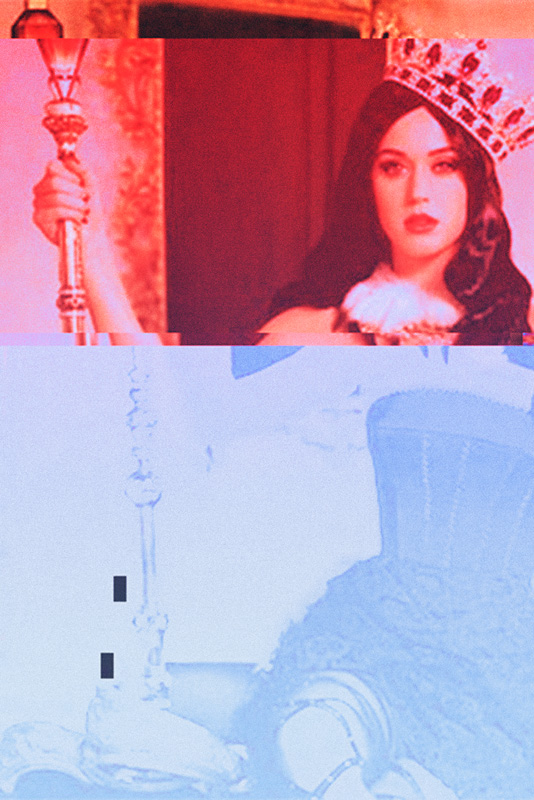
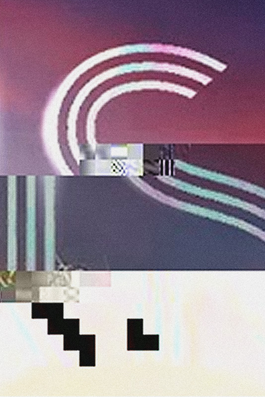

Warfighting, Business, and Defense Intelligence, 2013

Net Enabled Agile Force, 2013

John G. Grimes, Assistant Secretary of Defense for Networks and Informational Integrations / DoD Chief Information Officer, 2013

Cross-Agency Initiative Summary, 2013

Promotional Images of Katy Perry used for her 2013 album [*Prism*](http://en.wikipedia.org/wiki/Prism_(Katy_Perry_album)) embedded with data taken from NSA documents related to the [PRISM surveillance program](http://en.wikipedia.org/wiki/PRISM_(surveillance_program)). The work exists between the time when information regarding the surveillance program was leaked and when Katy Perry’s album title was announced. Search analytics reveal that the *Prism* album saturated search results for the term “Prism,” obscuring the government conspiracy.

