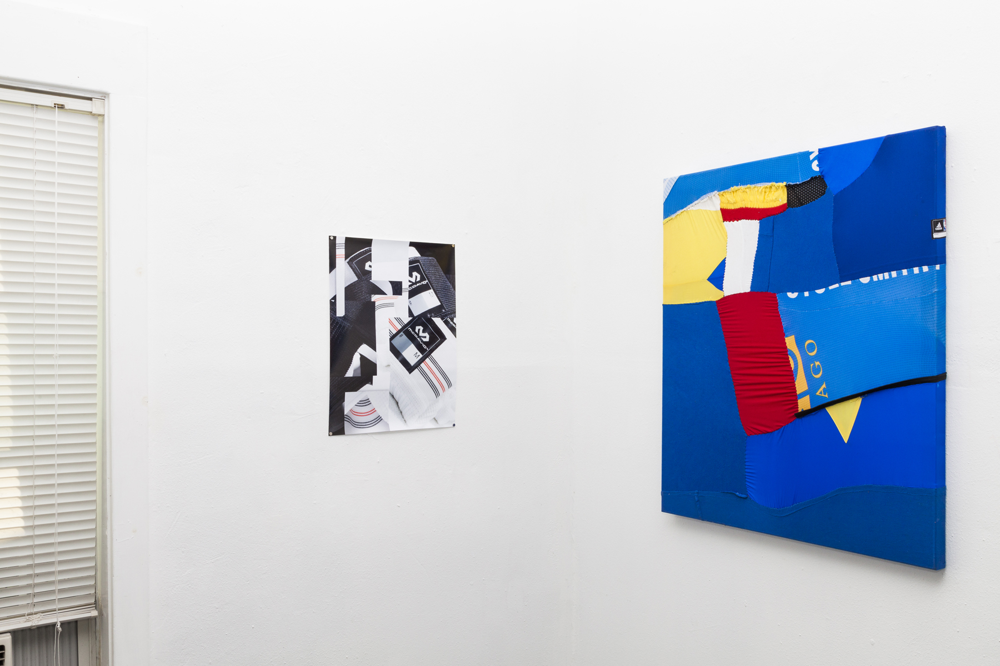
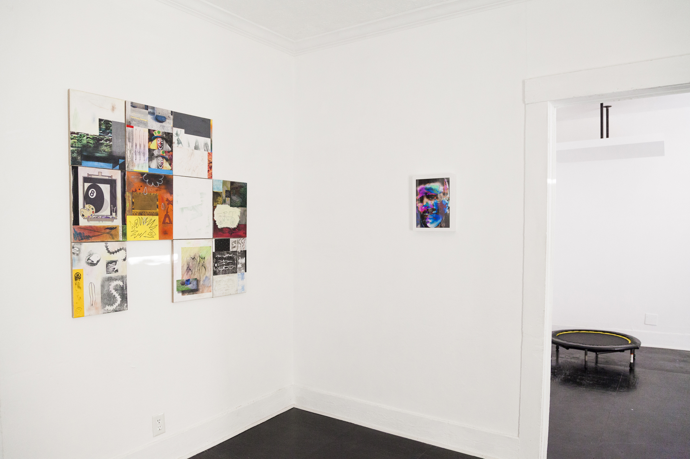

Left: Jock (gl)Itch, 2015

Middle: None / All of These People are Me, 2014

According to Jamora, “Obstructed Views” is inspired by his recent experience at a concert: *I had an obstructed view seat when I watched the Philippine Philharmonic Orchestra at Carnegie Hall. The elderly woman in front of me kept passing out and her head kept obstructing my view even more. But it’s classical music, not a basketball game. I could still hear the extraordinary music amplified by the acoustics of one of the world’s most famous stages. When I couldn’t see the performers, I would look around, enjoy the architecture. Watch the people in awe at the virtuosity of the musicians. Long story short, obstruction can force us to look beyond what is in plain view.* 

The exhibition will present painting, sculpture, and digital prints, which involve some form of layering or filter. Not only in the sense that one thing is on top of another. Perspective, time, and material are sewn, bent, swiped, and scrawled. Most of the work in the show incorporates several reference points, often disparate, but are the result of each artist’s process.